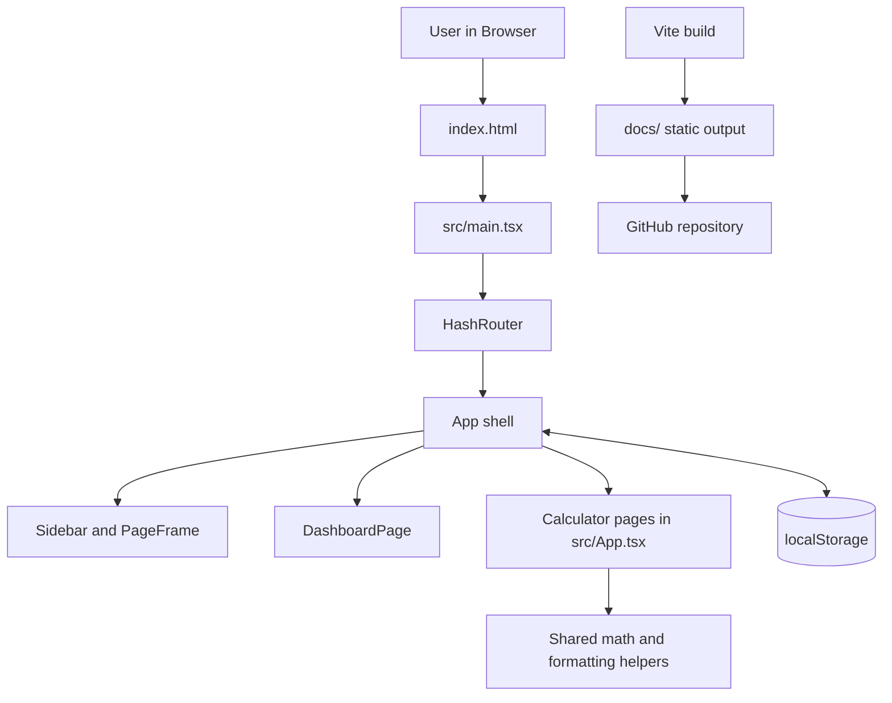

# Architecture

## High-Level System Overview

This codebase is a client-side calculator dashboard implemented as a single-page application (SPA) with React, TypeScript, and Vite. The application renders entirely in the browser, uses `HashRouter` for navigation between calculator pages, and keeps all calculation logic local to the front end in [`src/App.tsx`](/E:/Learnings/Projects/calculators/src/App.tsx). There is no server-side application code, no API client layer, no database integration, and no asynchronous network workflow present in the repository.

The deployed artifact is a static site build written to the tracked `docs/` directory via the Vite `outDir` setting in [`vite.config.ts`](/E:/Learnings/Projects/calculators/vite.config.ts). UI preferences such as theme and desktop sidebar state are persisted in browser `localStorage`, while calculator inputs and results are held in component state and recomputed on each render. A local PowerShell helper at [`build-and-push.ps1`](/E:/Learnings/Projects/calculators/build-and-push.ps1) automates build, commit, and push for the generated static output.

## Component Diagram

### Diagram Notes

- `index.html` provides the root container and bootstraps `src/main.tsx`.
- `src/main.tsx` mounts the React app inside `HashRouter`.
- `App` defines the shell, route table, sidebar, dashboard, and all calculator page routing.
- Each calculator page uses local React state plus shared helper functions in the same file.
- `localStorage` stores only theme and sidebar-collapse preferences.
- Vite builds the SPA into `docs/`, which is committed as static output.

## Data Flow

1. The browser loads [`index.html`](/E:/Learnings/Projects/calculators/index.html), which loads [`src/main.tsx`](/E:/Learnings/Projects/calculators/src/main.tsx).
2. `main.tsx` mounts `App` inside a `HashRouter`, so navigation is driven by the URL hash rather than server routes.
3. `App` reads initial UI preferences from `localStorage` through `getInitialTheme()` and `getInitialSidebarState()` and tracks responsive state through `useCompactViewport()`.
4. The route list in `calculatorRoutes` maps each slug to a page component, icon, and category. `Routes` renders either the dashboard or a calculator page wrapped in `PageFrame`.
5. A user enters values into inputs or presses calculator buttons. Those interactions update React state in the active page component.
6. Each page derives results synchronously during render by calling local helper functions such as `calculateEmi`, `calculateAge`, `evaluateExpression`, `decimalToFraction`, and number-formatting helpers.
7. Results are displayed immediately through `ResultPanel` or inline result cards. No request leaves the browser, and no queue, background worker, or persistent data store participates in the flow.
8. For release, `npm run build` compiles TypeScript and bundles the static app with Vite into `docs/`; `build-and-push.ps1` can then commit and push those generated files to `master`.

## Key Architectural Decisions

- Single-file feature composition: All routes, calculators, shared form components, and math helpers currently live in [`src/App.tsx`](/E:/Learnings/Projects/calculators/src/App.tsx). This keeps the app simple for a small project, but it also centralizes nearly all UI and domain logic in one file.
- Client-side only execution: Every calculation is computed in the browser with synchronous functions. This removes backend dependencies and makes the app usable offline after assets are loaded.
- Hash-based routing: [`src/main.tsx`](/E:/Learnings/Projects/calculators/src/main.tsx) uses `HashRouter`, which fits static hosting because page refreshes do not require server-side route handling.
- Static-site deployment to `docs/`: [`vite.config.ts`](/E:/Learnings/Projects/calculators/vite.config.ts) outputs builds to `docs/`, and the built files are tracked in Git. That matches GitHub Pages-style static publishing more closely than the unused `gh-pages -d dist` script in [`package.json`](/E:/Learnings/Projects/calculators/package.json).
- Local persistence only for presentation state: Theme and sidebar collapse state are stored in `localStorage`, while calculator values are transient. This avoids persisting financial or personal inputs beyond the current session unless the user leaves the page open.
- No async or service boundaries: The current architecture has no API layer, background processing, queues, Lambdas, or storage services. Any documentation or diagrams should treat the system as a browser SPA plus static assets, not as a distributed system.

## Tech Stack

| Layer | Technology | Location | Purpose |
| --- | --- | --- | --- |
| Language | TypeScript | [`src/App.tsx`](/E:/Learnings/Projects/calculators/src/App.tsx), [`src/main.tsx`](/E:/Learnings/Projects/calculators/src/main.tsx) | Application logic, typed React components, calculator formulas |
| UI library | React 19 | [`package.json`](/E:/Learnings/Projects/calculators/package.json) | Rendering the SPA and managing component state |
| Routing | `react-router-dom` `HashRouter` | [`src/main.tsx`](/E:/Learnings/Projects/calculators/src/main.tsx) | Client-side navigation between calculator pages |
| Icons | `lucide-react` | [`src/App.tsx`](/E:/Learnings/Projects/calculators/src/App.tsx) | Navigation and page iconography |
| Styling | Plain CSS | [`src/styles.css`](/E:/Learnings/Projects/calculators/src/styles.css) | Layout, theming, responsive behavior, calculator styling |
| Build tool | Vite 7 | [`package.json`](/E:/Learnings/Projects/calculators/package.json), [`vite.config.ts`](/E:/Learnings/Projects/calculators/vite.config.ts) | Development server and production bundling |
| Type checking/build orchestration | TypeScript compiler (`tsc -b`) | [`package.json`](/E:/Learnings/Projects/calculators/package.json), [`tsconfig.app.json`](/E:/Learnings/Projects/calculators/tsconfig.app.json) | Type-checking application and Vite config inputs |
| Static hosting artifact | `docs/` output directory | [`vite.config.ts`](/E:/Learnings/Projects/calculators/vite.config.ts) | Generated production site files |
| Client persistence | Browser `localStorage` | [`src/App.tsx`](/E:/Learnings/Projects/calculators/src/App.tsx) | Stores theme and sidebar collapse preference |
| Release helper | PowerShell | [`build-and-push.ps1`](/E:/Learnings/Projects/calculators/build-and-push.ps1) | Builds, stages, commits, and pushes generated site output |
